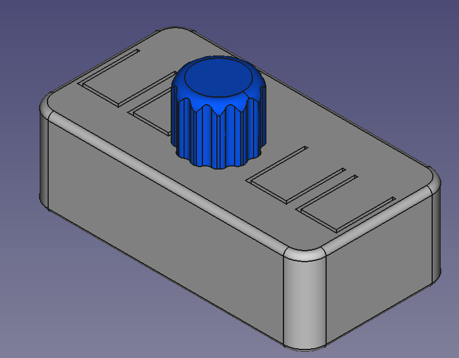

# This is Work in progress

# Introduction

This is simple design to connect a rotary encoder with pushbutton and 4 switches to an MCU using I2C. The design uses the common MCP23008 chip. The BOM is kept simple with as many common parts as possible. The encoder and switches have a small RC network in place for basic debouncing (you still need to handle this also in software).

The board provides pull up resistors for SCL, SDA and the !RESET pin. For each of them there also is a jumper to disable them.

NOTE: The rendering above has an encoder with round shaft, the knob is for an encoder with a D shaped shaft.

This board can be daisy chained. You just have to make sure each board uses a different addres by changing the jumpers A0,A1 and/or A2. Make sure you use the opendrain configuration of the interrupt pin if you want to use interrupts in this case.

# Files

 - The directory I2C-Encoder-Keys contains the KiCad (6) design files.
 - The BOM directory contains an bill of material generated by KiCad
 - 3D contains FreeCad design and 3D printable files (STL) for a case.
 - The root directory contains PDF of the schematic and PCB design.

# License 

See LICENSE.txt